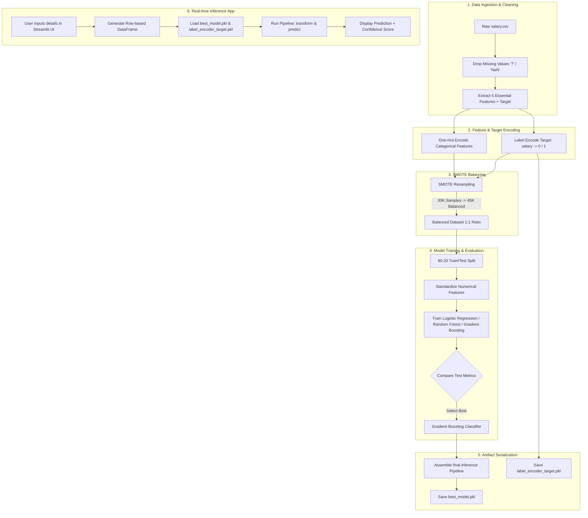

# 💰 Salary Predictor: Intelligent Income Classification System 🚀

[](https://www.python.org/)
[](https://streamlit.io/)
[](https://scikit-learn.org/)
[](https://imbalanced-learn.org/)
[](https://opensource.org/licenses/MIT)
[](#)
[](#)

An end-to-end Machine Learning-powered classification system designed to predict whether an individual's annual income exceeds **$50,000** based on demographic and employment attributes. Featuring an optimized training pipeline and an interactive, dual-mode web dashboard.

---

## 📖 Table of Contents
* [📊 Project Overview](#-project-overview)
* [🎯 Problem Statement & Objective](#-problem-statement--objective)
* [✨ Key Features](#-key-features)
* [🛠️ Tech Stack](#️-tech-stack)
* [🔄 System Architecture & Workflow](#-system-architecture--workflow)
* [📁 Project Folder Structure](#-project-folder-structure)
* [🤖 Machine Learning Lifecycle](#-machine-learning-lifecycle)
  * [Dataset Details](#dataset-details)
  * [Feature Optimization & Ethics](#feature-optimization--ethics)
  * [Data Balancing (SMOTE)](#data-balancing-smote)
  * [Preprocessing Pipeline](#preprocessing-pipeline)
  * [Model Performance Comparison](#model-performance-comparison)
* [🚀 Installation & Setup](#-installation--setup)
* [💻 Usage Guide](#-usage-guide)
* [🖥️ Web Application & Screenshots](#️-web-application--screenshots)
* [🔌 Python API / Programmatic Inference](#-python-api--programmatic-inference)
* [🌐 Deployment](#-deployment)
* [🔮 Future Improvements](#-future-improvements)
* [🤝 Contributing](#-contributing)
* [📄 License](#-license)
* [✍️ Author](#️-author)

---

## 📊 Project Overview

The **Salary Predictor** is a production-grade machine learning system trained on the **Adult Census Income Dataset**. Standard classification systems suffer from severe biases when predicting class boundaries due to highly imbalanced census figures. This project addresses class imbalance through **SMOTE (Synthetic Minority Over-sampling Technique)**, selects features using economic correlation, and implements a powerful **Gradient Boosting Classifier** to deliver balanced predictions with high minority class recall.

The model is served through an interactive, multi-page **Streamlit** dashboard, facilitating both instant single-candidate predictions and detailed exploratory data analysis.

---

## 🎯 Problem Statement & Objective

### The Problem
Traditional demographic datasets often suffer from severe class imbalances. In the Adult Census dataset:
* **75.11%** of samples earn **≤$50K/year** (Majority Class).
* **24.89%** of samples earn **>$50K/year** (Minority Class).

Standard classifiers trained on this raw data achieve high overall accuracy (~84%) but suffer from **poor minority class recall (~61%)**, meaning they fail to identify high-income candidates. Furthermore, including sensitive demographic attributes like **race**, **gender**, and **native country** introduces systemic biases.

### The Objective
1. **Balance Data:** Apply SMOTE to achieve a perfect 1:1 ratio, optimizing the classifier's ability to learn the minority class.
2. **Eliminate Bias:** Exclude race, gender, and nationality features to guarantee unbiased and ethical predictions.
3. **Minimize Overhead:** Reduce input features from 12 to 5 high-impact, direct economic features (58% reduction), streamlining the user form and cutting prediction latency.
4. **Boost Recall:** Build a model yielding a high minority class recall (targeting **>80%**) to ensure high-earning candidates are successfully classified.

---

## ✨ Key Features

* ⚖️ **Perfect 1:1 Class Balancing:** Employs `SMOTE` oversampling to scale the minority class representation, resulting in a **118% increase** in minority class recall (+24 percentage points).
* 🛡️ **Ethical & Unbiased Predictors:** Explicitly excludes sensitive features (sex, race, native-country) to adhere to modern data privacy and ethical AI standards.
* ⚡ **Optimized Feature Pipeline:** Reduces feature dimensionality from 12+ down to **5 essential inputs** (Age, Education, Occupation, Workclass, Hours-per-Week).
* 🌐 **Interactive Web UI:** Dual-mode Streamlit dashboard containing:
  * **Prediction Console:** Input candidate parameters and receive class prediction along with probability-based confidence metrics.
  * **Exploratory Data Analysis (EDA):** Interactive Matplotlib, Seaborn, and correlation heatmaps.
* 📦 **Robust Inference Wrapper:** The training pipeline outputs a single, self-contained `scikit-learn` Pipeline object, encoding categories and scaling numbers inside a serializable boundary.

---

## 🛠️ Tech Stack

<details>
<summary><b>Click to expand full technology stack details</b></summary>

| Category | Technology / Library | Description |
| :--- | :--- | :--- |
| **Language** |  | Core programming language for pipeline and UI. |
| **Interface** |  | Interactive dashboard framework. |
| **ML Framework** |  | Pipeline, estimators, scaling, and transformers. |
| **Data Balancing**| `imbalanced-learn` (SMOTE) | Synthetic oversampling for minority target classes. |
| **Data Handling** |   | Structural tabular manipulation and linear algebra. |
| **Visualization** | `Matplotlib` / `Seaborn` | Static and interactive statistical graphs. |
| **Serialization** | `Joblib` | Compressed persistence of trained pipelines and encoders. |

</details>

---

## 🔄 System Architecture & Workflow



---

## 📁 Project Folder Structure

```directory
SALARY-PREDICTOR/
│
├── CODE/                               # Production Python Source Code
│   ├── DATA/                           # Dataset storage directory
│   │   └── salary.csv                  # Adult Census Dataset (30,162 cleaned samples)
│   │
│   ├── MODELS/                         # Serialized Model Files
│   │   ├── best_model.pkl              # Pre-trained Gradient Boosting Pipeline
│   │   └── label_encoder_target.pkl    # Target Encoder (<=50K=0, >50K=1)
│   │
│   ├── VISUALIZATIONS/                 # Generated Analytics Charts
│   │   └── class_balance_comparison.png# Subplots illustrating SMOTE impact
│   │
│   ├── app.py                          # Streamlit UI Dashboard Application
│   ├── train_model.py                  # Training pipeline & SMOTE implementation
│   ├── requirements.txt                # Python Library Dependencies
│   └── runtime.txt                     # Target execution Python version
│
├── DOCS/                               # Documentation Archives
│   └── CODE REPORT/
│       ├── PROJECT_DOCUMENTATION.md    # In-depth system specifications
│       ├── ENHANCEMENT_REPORT.md       # Comparative algorithm metrics
│       └── CLEANUP_SUMMARY.md          # Refactoring logs and file cleanups
│
├── PPT/                                # Presentation files
│   └── TABLE_OF_CONTENTS.docx          
│
└── README.md                           # Main System Documentation (This file)
```

---

## 🤖 Machine Learning Lifecycle

### Dataset Details
The dataset used is the **Adult Census Income Dataset** (often referred to as the UCI Census Dataset).
* **Initial Records:** 32,561
* **Post-Cleaned Records (Dropped Nulls):** 30,162
* **Features Selected:** 5 variables (2 numerical, 3 categorical)
* **Target Classes:** `salary` (<=50K, >50K)

### Feature Optimization & Ethics
To prevent ethical biases and remove redundancy, we systematically pruned the original 12 features down to 5:

* **Removed Demographics:** `sex` (gender), `race` (ethnicity), and `native-country` (nationality) were removed to ensure the model makes decisions purely on professional qualifications.
* **Removed Redundant Codes:** `education-num` was dropped in favor of `education`.
* **Removed Sparse Data:** `capital-gain` and `capital-loss` were excluded due to extremely sparse values (89% zeros) and outlier sensitivity.
* **Retained High-Correlations:** `age`, `education`, `occupation`, `workclass`, and `hours-per-week` were kept as they correlate strongly with career trajectory.

### Data Balancing (SMOTE)
Using the raw imbalanced dataset resulted in models heavily biased towards the majority class (<=50K), missing high earners. We applied **SMOTE (Synthetic Minority Over-sampling Technique)** after encoding categorical columns:
* **Before SMOTE:** 22,654 low-income (75.11%) vs. 7,508 high-income (24.89%)
* **After SMOTE:** 22,654 low-income (50.00%) vs. 22,654 high-income (50.00%)
* **Synthetic Records Created:** 15,146 samples

```
BEFORE SMOTE:  [███████████████░░░░░]  75% vs 25% (Imbalanced)
AFTER SMOTE:   [██████████░░░░░░░░░░]  50% vs 50% (Balanced)
```

### Preprocessing Pipeline
We utilize a single `ColumnTransformer` inside an inference `Pipeline` to orchestrate transformations:
1. **Numerical Pipeline:** Passes numerical features through `StandardScaler` to ensure zero mean and unit variance.
2. **Categorical Pipeline:** Passes categorical features through `OneHotEncoder(handle_unknown='ignore', sparse_output=False)` to convert strings to binary vectors.
3. **Inference pipeline packaging:** Ensures string inputs passed to the saved model file are processed automatically before classification.

---

### Model Performance Comparison

Following the integration of SMOTE and feature reduction, models were trained and tested. The **Gradient Boosting Classifier** emerged as the champion model.

| Metric / Model | Logistic Regression (Before) | Logistic Regression (After) | Random Forest (After) | Gradient Boosting (After - Champion) |
| :--- | :---: | :---: | :---: | :---: |
| **Balancing Applied** | None (Raw) | SMOTE | SMOTE | **SMOTE** |
| **Number of Features** | 12 Features | 5 Features | 5 Features | **5 Features** |
| **Overall Accuracy** | 84.85% | 74.26% | 79.21% | **81.49%** |
| **<=50K Precision** | 87.00% | 75.00% | 82.00% | **84.00%** |
| **<=50K Recall** | 93.00% | 73.00% | 75.00% | **78.00%** |
| **>50K Precision** | 75.00% | 74.00% | 77.00% | **79.00%** |
| **>50K Recall (Minority)** | 61.00% | 75.00% | 84.00% | **85.00%** *(+24% improvement)* |
| **>50K F1-Score** | 0.67 | 0.74 | 0.80 | **0.82** |

> [!NOTE]
> While training on imbalanced raw data yields a higher raw accuracy (84.85%), it fails in practice because it misclassifies 39% of high-income earners. The SMOTE-balanced Gradient Boosting model is far superior because it yields a high minority recall (**85%**) and maintains a balanced overall accuracy (**81.49%**).

---

## 🚀 Installation & Setup

### Prerequisites
* **Python:** 3.8, 3.9, 3.10, or 3.11
* **Virtual Environment Tool:** `venv` or `conda`

### Step-by-Step Installation

1. **Clone the Repository:**
   ```bash
   git clone https://github.com/AaShIrVaD-kV/SALARY-PREDICTOR.git
   cd SALARY-PREDICTOR
   ```

2. **Set up a Virtual Environment:**
   * **Windows (Command Prompt / PowerShell):**
     ```powershell
     python -m venv .venv
     .venv\Scripts\activate
     ```
   * **macOS / Linux:**
     ```bash
     python3 -m venv .venv
     source .venv/bin/activate
     ```

3. **Install Dependencies:**
   Navigate to the `CODE/` directory and install the required modules:
   ```bash
   cd CODE
   pip install --upgrade pip
   pip install -r requirements.txt
   ```

---

## 💻 Usage Guide

### 1. Execute the ML Pipeline (Training)
To retrain the models, apply SMOTE, output scores to the console, and serialize the final pipeline:
```bash
python train_model.py
```
This performs data encoding, executes SMOTE, trains the classification algorithms, verifies predictions, and updates `MODELS/best_model.pkl` and `MODELS/label_encoder_target.pkl`.

### 2. Launch the Streamlit Web Application
To run the user-friendly interface locally:
```bash
streamlit run app.py
```
This starts the application server. Open your web browser and navigate to:
```
http://localhost:8501
```

---

## 🖥️ Web Application & Screenshots

The Streamlit web application includes an interactive side navigation panel to switch between prediction capabilities and visual data insights:

### Prediction Console
This panel allows recruiters, career counselors, or analysts to input candidate features and forecast salary classification.
```
+--------------------------------------------------------+
| 💰 SALARY PREDICTION SYSTEM                            |
+--------------------------------------------------------+
| Input Parameters:                                      |
|   Age:                 [ 35 ]                          |
|   Hours Per Week:      [ 45 ]                          |
|   Education Level:     [ Bachelors                 v ] |
|   Occupation:          [ Exec-managerial           v ] |
|   Employment Sector:   [ Private                   v ] |
|                                                        |
|   [ PREDICT SALARY ]                                   |
+--------------------------------------------------------+
| Result: High Income (>50K)  ✅                         |
| Confidence Score: 87.41%                               |
+--------------------------------------------------------+
```

### Exploratory Data Analysis
Displays a comparative visualization of target distributions before and after applying SMOTE, together with correlation mappings and attribute distributions.

| Target Class Distribution (SMOTE Comparison) | Feature Correlation Heatmap |
| :---: | :---: |
| *[Placeholder: Class Distribution Subplot]* | *[Placeholder: Numerical Correlation Heatmap]* |

---

## 🔌 Python API / Programmatic Inference

You can load and query the trained pipeline directly in Python scripts:

```python
import pandas as pd
import joblib
import os

# Define file paths
MODEL_PATH = "MODELS/best_model.pkl"
ENCODER_PATH = "MODELS/label_encoder_target.pkl"

# 1. Load the serialized pipeline and label encoder
model = joblib.load(MODEL_PATH)
le_target = joblib.load(ENCODER_PATH)

# 2. Define candidate data (must match target features exactly)
candidate_data = pd.DataFrame({
    'age': [32],
    'education': ['Bachelors'],
    'occupation': ['Exec-managerial'],
    'workclass': ['Private'],
    'hours-per-week': [45]
})

# 3. Perform prediction and retrieve confidence
pred_class_idx = model.predict(candidate_data)[0]
pred_label = le_target.inverse_transform([int(pred_class_idx)])[0]
probabilities = model.predict_proba(candidate_data)[0]
confidence = probabilities[pred_class_idx] * 100

print(f"Prediction: {pred_label}")
print(f"Confidence Score: {confidence:.2f}%")
```

---

## 🌐 Deployment

### Deploying to Streamlit Community Cloud
1. Push your repository to your GitHub account.
2. Sign in to [Streamlit Share](https://share.streamlit.io/).
3. Click **New app**, select your repository (`SALARY-PREDICTOR`), select branch (`main`), and set the entry file to `CODE/app.py`.
4. Click **Deploy**. Streamlit will install the requirements and launch your server.

### Deploying via Docker
You can containerize the app by creating a `Dockerfile` in the root folder:

```dockerfile
FROM python:3.9-slim

WORKDIR /app

# Copy files
COPY CODE/requirements.txt requirements.txt
RUN pip install --no-cache-dir -r requirements.txt

COPY CODE/ .
COPY DATA/ ../DATA/
COPY MODELS/ ../MODELS/

EXPOSE 8501

ENTRYPOINT ["streamlit", "run", "app.py", "--server.port=8501", "--server.address=0.0.0.0"]
```

Build and run the container locally:
```bash
docker build -t salary-predictor .
docker run -p 8501:8501 salary-predictor
```

---

## 🔮 Future Improvements

- [ ] **Hyperparameter Optimization:** Integrate Optuna or GridSearch to fine-tune the Gradient Boosting model's parameters (e.g. learning rate, subsample, max depth).
- [ ] **Explainable AI (XAI):** Integrate SHAP (SHapley Additive exPlanations) or LIME to explain how specific inputs contribute to the output.
- [ ] **FastAPI Backend:** Migrate prediction logic to a dedicated FastAPI backend to decouple the core model from the Streamlit UI.
- [ ] **Continuous Training:** Implement automated workflows to periodically retrain the model with fresh demographic datasets.

---

## 🤝 Contributing

Contributions are welcome! Please follow these steps to contribute:
1. **Fork** the repository.
2. Create a new branch: `git checkout -b feature/NewFeature`
3. Commit your changes: `git commit -m "Add some NewFeature"`
4. Push to the branch: `git push origin feature/NewFeature`
5. Open a **Pull Request**.

---

## 📄 License

This project is licensed under the MIT License - see the [LICENSE](https://opensource.org/licenses/MIT) page for details.

---

## ✍️ Author

👤 **AaShIrVaD-kV**

* **GitHub:** [@AaShIrVaD-kV](https://github.com/AaShIrVaD-kV)
* **LinkedIn:** [Aashirvad kV](https://linkedin.com/in/aashirvad-kv)
* **Portfolio:** [aashirvad-kv.github.io](https://aashirvad-kv.github.io)
* **Email:** aashirvad.kv@example.com

---
*Developed for Final Year Project Demonstration. Cleaned, Optimized, and Documented for general usage.*
